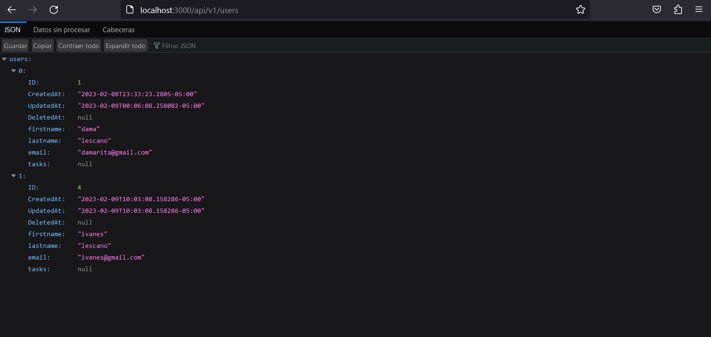
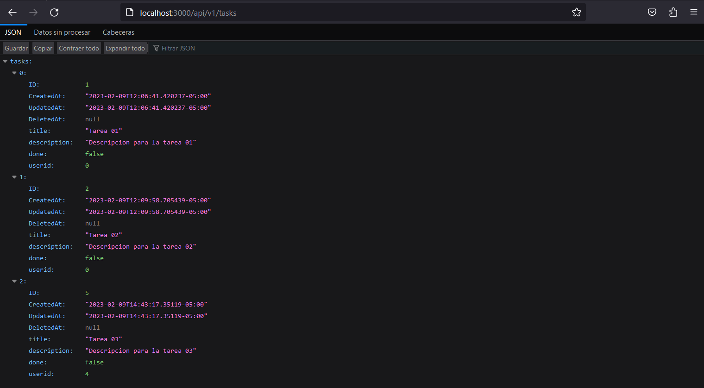
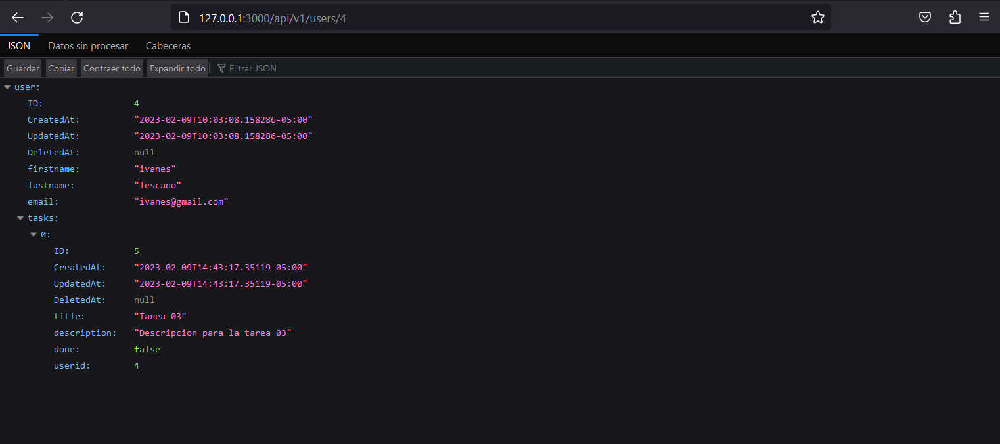

# GoPostgresAPI
Esta aplicacion es una backend realizada con el framework fiber de GO.

#SERVER (backend)


### Paquetes
- Instalamos air que nos permitira aplicar y reiniciar de forma automatica al servidor de go
```
go install github.com/cosmtrek/air@latest
```
-Una vez instalado ejecutamos los comandos que nos permitiran establecer un archivo de configuracion y el otro ejecutar nuestro servidor respectivamente
```
ait init
```
```
air
```

### DATABASE
- Utilizamos el paquete gorm y tambien el driver de la respectiva bdd que vamos a usar en este caso postgreSQL para GO [Documentacion Gorm](https://gorm.io/docs/)
```
go get -u gorm.io/gorm
```
```
 go get -u gorm.io/driver/postgres 
```

### DOKER
- Iniciamos docker y posterior a eso ejecutamos en el terminal el comando para crear un container de postgres con docker
- Instalamos primero la imagen de postgres
 ```
 docker pull postgres
 ```
- Creamos un contenedor en este caso con el nombre mypostgress , configuramos el puerto en el que quiero que se ejecute, las variables de entorno para la password y el user y por ulltimo le decismo -d(ditach) para que el contenedor se quede ejecutando en segundo plano
```
docker run --name mypostgres -p 5432:5432 -e POSTGRES_PASSWORD=sistemas -e POSTGRES_USER=ivan -d postgres
```
- Con el siguiente comando podremos visualizar nuestros contenedores 
```
docker ps 
```
- Ahora debemos  ejecutar el contenedor de la bdd de esta manera -it (iteractiva)
```
docker exec -it mypostgres bash
```
- Para conectarnos a postgreSQL
```
psql -U ivan --password 
```
### Comandos de postgreSQL

- El siguiente comando para crear una bdd con el nombre que le querramos poner en este caso elegi "gorm".
```
CREATE DATABASE gorm;
```
- Para ver tablas y sus relaciones , de igual manera podemos ver los campos de cada tabla
```
\d
```
- Para ver todas las base de datos creadas
```
\l
```
- Para conectarnos ejecutamos el comando con el nombre de la bdd
```
\c gorm
```


 ### Preview


<p align="center">
    
<p/>


<p align="center">
    
<p/>

<p align="center">
    
<p/>


